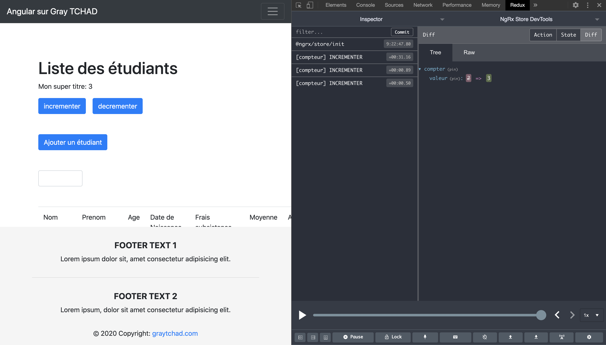

# Leçon 25 Angular

## [ Outils de déboggage ngrx](https://ngrx.io)

***installation de la librairie***

``` console
ng add @ngrx/store-devtools
```

***dans le module***

``` typescript
...
StoreDevtoolsModule.instrument({
	maxAge: 25,
	logOnly: environment.production 
})
...
```

***installation de l'extension chrome***


